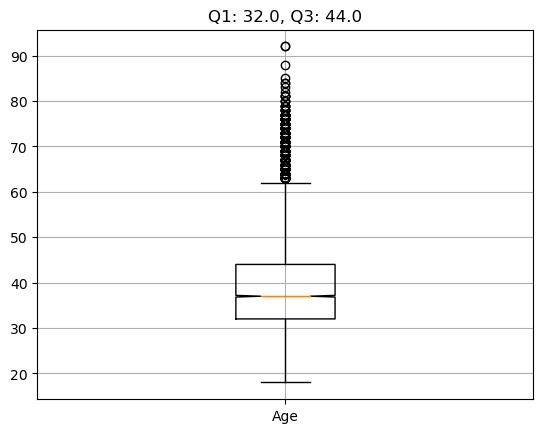

# Bank Customer Churn
This is a team collaboration project relevant to Machine Learning, Neural Networks, and predictions based on various learning models.

## Table of Contents

- [Overview of Project](#overview-of-project)
  - [Team Member](#team-member)
  - [Topic Selection](#topic-selection)
  - [Purpose of Project](#purpose-of-project)
  - [Current Status](#current-status)
- [Segment 1: Sketch It Out](#segment-1-sketch-it-out)
  - [Resources](#resources)
  - [Model Selection Criteria](#model-selection-criteria)
- [Segment 2: Build and Assemble](#segment-2-build-and-assemble)
  - [Analysis Results](#analysis-results)
- [Segment 3: Put It All Together](#segment-3-put-it-all-together)
  - [Summary](#summary)
- [References](#references)

## Overview of Project

This project is divided into three Segments: Segment 1, Segment 2, and Segment 3. A checkbox with checkmark in it indicates that the corresponding segment and tasks are completed. 

- ✅ Segment 1: Sketch It Out.
- ✅ Segment 2: Build and Assemble.
- 🟩 Segment 3: Put It All Together.

### Team Member

Andia, Chris, Joey, Liwen, and Parto (alphabetical order).

### Topic Selection

We began exploring different datasets to address the question of when a company should execute layoffs. Unfortunately, for IPOs, the datasets we found contained less than 500 rows of relevant data. This seemed too small to create a robust machine learning model. We continued to explore different datasets regarding layoffs, but also began exploring the idea of creating a project regarding customer churn. One question to answer regarding customer churn is, what are the factors that lead to a customer either continuing or terminating their involvement (subscription, account, etc.) with the company. After viewing some datasets on telecom and bank customer churn, it seemed that these datasets had sufficient dimensions (such as tenure and credit score for the bank datasets) and many rows over 10000 to create a learning model. We will continue exploring this idea during the second class of our Final Project. Here is the link to the original dataset selected for our deep dive, [Churn of Bank Customers](https://www.kaggle.com/datasets/mathchi/churn-for-bank-customers?resource=download).

Questions that our team plans to answer is how to predict churn rate of customers based on bank customers' involvement, the reason(s) why customers left, and whether Machine Learning or Neural Network models can help our stakeholders solve.

### Purpose of Project

This project was the final team project to cultivate collaboration, teamwork, and effective use of collaboration tools, such as GitHub, Database Management System (DBMS), and online story board/dashboard. During this project, we were also encouraged to focus on Machine Learning or Neural Network models, and apply those techniques to solve a real world case study. Here are a few systematic steps that we have performed to find the best performing solution(s).

- Examine historical dataset.
- Preprocess the dataset, including proper data cleaning, standardization, and scaling whichever is necessary.
- Identify potential causes for bank customer churn.
- Develop Machine learning model to predict churn rate.

### Current Status

- ✅ Topic selection has been finalized: prediction of bank customer churn rate.

- ✅ Assessment of dataset and database management system (DBMS) is completed.
  - Our dataset consisted of 10000 rows and 14 columns. A few numeric columns contained some outliers as illustrated in Fig. 1(a)&ndash;(c).
  - A PostgreSQL database that stores two tables, called **main_df** and **clean_df**, was created and can be connected without problems from Python code of each Team Member. We documented some SQL queries for retrieving some data from the database ([BankCustomerChurn_ModelSelection.ipynb](./BankCustomerChurn_ModelSelection.ipynb)).

  

  <table><tr><td></td><td></td><td></td></tr></table>

  **Fig. 1 Boxplots of several numerical columns containing some outliers: (a) Column CreditScore, (b) Column Age, and (c) Column NumOfProducts.**
  

    
  **Fig. 2 Bank Customer Churn fabricated DBMS (PostgreSQL).**

- ✅ Preprocessing dataset and EDA is completed. The cleaned datasets, [Churn_Modelling_main.csv](./Resources/Churn_Modelling_main.csv) and [Churn_Modelling_cs_lt850.csv](./Resources/Churn_Modelling_cs_lt850.csv), are stored in the GitHub repo and PostgreSQL database.

- ✅ Model Testing and Determination.
  - Evaluation Machine Learning or Neural Network models that could effectively predict bank customer churn rate.
  - Optimization of our final models is completed.

- 🟩 Final Presentation.
  - Final presentation and story/dashboard are available online.

## Segment 1: Sketch It Out

Our team discussed our overall project objectives and resources (datasets, technologies, software, ML/NN models, etc.), selected a question/topic to focus on, and then built a simple model. We then prototyped our team's ideas by using either CSV or JSON files to connect the model to a fabricated database.

### Resources

- GitHub repository: [Bank-Customer-Churn](https://github.com/chris820629/Bank-Customer-Churn) for sharing our analysis details, datasets, and results.
- Source code: [BankCustomerChurn_ModelSelection.ipynb](./BankCustomerChurn_ModelSelection.ipynb), [BankCustomerChurn_EDA.ipynb](./BankCustomerChurn_EDA.ipynb).
- Source data: [Churn_Modelling_2.csv](./Resources/Churn_Modelling_2.csv) (source: [Churn of Bank Customers](https://www.kaggle.com/datasets/mathchi/churn-for-bank-customers?resource=download)).
- Database data: [Churn_Modelling_main.csv](./Resources/Churn_Modelling_main.csv), [Churn_Modelling_cs_lt850.csv](./Resources/Churn_Modelling_cs_lt850.csv), [Churn_Modelling_cs_lt2sigma.csv](./Resources/Churn_Modelling_cs_lt2sigma.csv).
- Fabricated DBMS: PostgreSQL ([Bank Customer Churn fabricated DBMS](./Data/BankCustomerChurn_fabricated_db.png)).
- Image file: png files.
- Software: [Pandas User Guide](https://pandas.pydata.org/pandas-docs/stable/user_guide/index.html#user-guide), [Scikit-learn User Guide - Supervised Learning](https://scikit-learn.org/stable/supervised_learning.html), [Python imbalanced-learn](https://pypi.org/project/imbalanced-learn/).
- Tableau dashboard: [Tableau Dashboard](https://public.tableau.com/views/BankCustomerChurnAnalysis_16754641709880/BankCustomerChurnAnalysis?:language=en-US&publish=yes&:display_count=n&:origin=viz_share_link).

### Model Selection Criteria

Based on our assessment and analysis of the bank customer churn dataset, a few machine learning models were isolated and applied to optimize our predictions. Below is the summary of the model selection criteria that we have applied in this study.

- Is the label variable known? **Yes**. We then narrowed down our models to either supervised learning or neural network models.
- Is the target variable categorical? **Yes**. Our target variable contained dichotomous (binary) categorical values, which suggested that classification-based supervised learning would be effective in predicting bank customer churn rate.
- Do our features contain numerical (continuous/interval) and categorical (*object* or *string* data type) values? **Yes**. We then applied Pandas `get_dummies()` method to encode those categorical values.
- Out of 10000 total rows, the ratio of our target values was approximately 4:1, which could be considered imbalanced. One of the over-/under-sampling combination techniques called `SMOTEENN` could be employed to rebalance our target values. BalancedRandomForestClassifier would be better than typical `SMOTEENN` or bagging classifiers because it learns from imbalanced bootstrap samples.
- As for model optimization, we further trained and tested our models of choice (*Ensemble Learning*) by tuning several hyper-parameters to derive the optimal parameters for our final models.

## Segment 2: Build and Assemble

Our team performed some experiments to test and train our models, build the database that we will use for our final presentation, and create both our dashboard and presentation.

### Analysis Results

**Table 1. Condensed summary statistics of all ensemble learning models (Used datasets: *Original* with all outliers vs. *CS &lt; 850* without credit scores >= 850. Used metrics: low &lt; 60%, good = 60&ndash;70%, very good = 70&ndash;90%, high &ge; 90%).**  
| Ensemble algorithm     | Dataset-Exited | Balanced  accuracy score | Precision | Recall  | F1 score | Conclusion                         |
| :--                    | :--:           |           :--: |       --: |     --: |      --: | :--                                             |
| RandomForestClassifier | Original-0     |   0.736840     | 0.89      |    0.90 |  0.90    | Very good accuracy; **high recall/F1 score**    |
| (with SMOTEENN)        | Original-1     |   0.736840     | 0.61      |    0.57 |  0.59    | Very good accuracy; *low recall/F1 score*       |
| RandomForestClassifier | Original-0     |   0.712432     | 0.87      |    0.97 |  0.92    | Very good accuracy; **high recall/F1 score**    |
|                        | Original-1     |   0.712432     | 0.79      |    0.46 |  0.58    | Very good accuracy; *low recall/F1 score*       |
| BalancedRandomForest   | Original-0     |   0.730740     | 0.88      |    0.93 |  0.91    | Very good accuracy; **high recall/F1 score**    |
| (with SMOTEENN)        | Original-1     |   0.730740     | 0.66      |    0.53 |  0.59    | Very good accuracy; *low recall/F1 score*       |
| BalancedRandomForest   | Original-0     |   0.784557     | 0.93      |    0.81 |  0.86    | Very good accuracy/recall/F1 score              |
|                        | Original-1     |   0.784557     | 0.51      |    0.76 |  0.61    | Very good accuracy/recall; good F1 score        |
| EasyEnsembleClassifier | Original-0     |   0.734567     | 0.89      |    0.90 |  0.89    | Very good accuracy/F1 score; **high recall**    |
| (with SMOTEENN)        | Original-1     |   0.734567     | 0.60      |    0.57 |  0.58    | Very good accuracy; *low recall/F1 score*       |
| EasyEnsembleClassifier | Original-0     |   0.778234     | 0.93      |    0.80 |  0.86    | Very good accuracy/recall/F1 score              |
|                        | Original-1     |   0.778234     | 0.50      |    0.75 |  0.60    | Very good accuracy/recall; good F1 score        |
| AdaBoostClassifier     | Original-0     |   0.742793     | 0.90      |    0.87 |  0.88    | Very good accuracy/recall/F1 score              |
| (with SMOTEENN)        | Original-1     |   0.742793     | 0.55      |    0.62 |  0.58    | Very good accuracy; good recall; *low F1 score* |
| AdaBoostClassifier     | Original-0     |   0.729186     | 0.88      |    0.96 |  0.92    | Very good accuracy; **high recall/F1 score**    |
|                        | Original-1     |   0.729186     | 0.78      |    0.49 |  0.61    | Very good accuracy; *low recall*; good F1 score |
| RandomForestClassifier | CS < 850-0     |   0.741063     | 0.90      |    0.89 |  0.89    | Very good accuracy/recall/F1 score              |
| (with SMOTEENN)        | CS < 850-1     |   0.741063     | 0.56      |    0.59 |  0.58    | Very good accuracy; *low recall/F1 score*       |
| RandomForestClassifier | CS < 850-0     |   0.701590     | 0.88      |    0.96 |  0.92    | Very good accuracy; **high recall/F1 score**    |
|                        | CS < 850-1     |   0.701590     | 0.75      |    0.44 |  0.55    | Very good accuracy; *low recall/F1 score*       |
| BalancedRandomForest   | CS < 850-0     |   0.738949     | 0.90      |    0.91 |  0.90    | Very good accuracy; **high recall/F1 score**    |
| (with SMOTEENN)        | CS < 850-1     |   0.738949     | 0.60      |    0.57 |  0.59    | Very good accuracy; *low recall/F1 score*       |
| BalancedRandomForest   | CS < 850-0     |   0.772251     | 0.93      |    0.81 |  0.86    | Very good accuracy/recall/F1 score              |
|                        | CS < 850-1     |   0.772251     | 0.48      |    0.74 |  0.58    | Very good accuracy/recall; *low F1 score*       |
| EasyEnsembleClassifier | CS < 850-0     |   0.741146     | 0.90      |    0.88 |  0.89    | Very good accuracy/recall/F1 score              |
| (with SMOTEENN)        | CS < 850-1     |   0.741146     | 0.55      |    0.60 |  0.58    | Very good accuracy; good recall; *low F1 score* |
| EasyEnsembleClassifier | CS < 850-0     |   0.771172     | 0.93      |    0.79 |  0.85    | Very good accuracy/recall/F1 score              |
|                        | CS < 850-1     |   0.771172     | 0.47      |    0.75 |  0.58    | Very good accuracy/recall; *low F1 score*       |
| AdaBoostClassifier     | CS < 850-0     |   0.753748     | 0.91      |    0.86 |  0.88    | Very good accuracy/recall/F1 score              |
| (with SMOTEENN)        | CS < 850-1     |   0.753748     | 0.53      |    0.65 |  0.58    | Very good accuracy; good recall; *low F1 score* |
| AdaBoostClassifier     | CS < 850-0     |   0.717164     | 0.88      |    0.95 |  0.92    | Very good accuracy; **high recall/F1 score**    |
|                        | CS < 850-1     |   0.717164     | 0.71      |    0.48 |  0.58    | Very good accuracy; *low recall/F1 score*       |

<table><tr><td></td><td></td></tr><tr><td></td><td></td></tr></table>

**Fig. 3 Sorted feature importances of (a) the original dataset, (b) the dataset with CreditScore &lt; 850, (c) the original dataset with SMOTEENN, and (d) the dataset with SMOTEENN and CreditScore &lt; 850.**

## Segment 3: Put It All Together

We put the final touches on our models, database, and dashboard. Then create and deliver our final presentation to the class. We have been working on improving the accuracy and sensitivity of our learning models and preparing story/dashboard for presenting our data effectively.

- Optimization of our learning models.
- Will transform the summary statistics table into a fabricated database that can also be used for Tableau dashboard/story.
- Final touches.

### Summary

**Table 1&ndash;2** summarize the main reasons why we preferred the ensemble learning models over the others for our study.

**Table 2. Assessments of learning model selection (RFC: RandomForestClassifier, BRFC: BalancedRandomForestClassifier, EEC: EasyEnsembleClassifier, ABC: AdaBoostClassifier, NN/DNN: Neural Network/Deep Neural Network, LogisticR: LogisticRegression).**  
| Learning algorithm            | RFC  | BRFC | EEC  | ABC  | NN/DNN   | LogisticR |
| :--                           | :--: | :--: | :--: | :--: | :--:     | :--:      |
| Bagging/Bootstrap Aggregating | Yes  | Yes  | No   | No   | Yes      |  No       |
| Boosting                      | No   | No   | Yes  | Yes  | Yes      |  No       |
| Simple & fast training time   | No   | No   | No   | No   | No       |  Yes      |
| Applicable to large datasets  | Yes  | Yes  | Yes  | Yes  | Yes      |  No       |
| Applicable to non-linear data | Yes  | Yes  | Yes  | Yes  | Yes      |  No       |
| Applicable to many features   | Yes  | Yes  | Yes  | Yes  | Yes      |  No       |
| Require scaling of features   | No   | No   | No   | No   | No       |  Yes      |
| Robust to under/overfitting   | Yes  | Yes  | No   | No   | No       |  No       |
| Model interpretation          | Yes  | Yes  | Yes  | Yes  | Black box |  Yes      |
| Suitable for this project     | 🟢  | 🟢  | 🟢  | 🟡  | 🟡      |  ⛔       |
| Learning models of choice     | 💚  | 💚    | 💛  | 💛  | 💛      |  💔       |

### Result of Optimization

**Table 3. RandomForestClassifier with SMOTEENN resampling using dataset of credit score less than 850 only before and after model optimization.**
| Optimization | Exited | Balanced accuracy score	| Precision	| Recall	| F1 score |
| :--          | :--    | :--                     | :--       | :--     | :--      |
| Before	     | 0	    | 0.74	                  | 0.90	    | 0.89	  | 0.89     |
| Before	     | 1	    | 0.74	                  | 0.56	    | 0.59	  | 0.58     |
| After	       | 0	    | 0.90	                  | 0.90	    | 0.87	  | 0.88     |
| After	       | 1	    | 0.90	                  | 0.89	    | 0.92	  | 0.90     |

### Furture Recommendation

Model selected after optimization is sufficient and successful. Here are some challenges and limitations we identified during the process: 
- Unconscious bias: when analyzing data and deciding to remove outliers with certain criteria without awareness of underlying causes, for instance, why many cases with credit score to their maximal level. 
- Limited data source: with this data source, unfortunately, it is unavailable to request more data features when we were in doubt, for example, we would like to know if other data is available like when customers with balance of 0, how long was the balance becoming 0. 
- Over/Underfitting: when real world data input, further training and testing are needed to reassure no overfitting or underfitting.

With all, a few recommendations that might improve our prediction are listed below: 
- Explore other data source and establish more concrete parameters to regulate training and testing data moving forward. 
- Consider to transform dataset with less than 2 sigma range in certain features. 
- Neural network deep learning with optimization could be further performed with the benefit of inclusive multiple unknown neurons and dense layers. 

## References

[Pandas User Guide](https://pandas.pydata.org/pandas-docs/stable/user_guide/index.html#user-guide)  
[TensorFlow Documentation](https://www.tensorflow.org/guide/)  
[Scikit-learn User Guide - Supervised Learning](https://scikit-learn.org/stable/supervised_learning.html)  
[Matplotlib - Plot types](https://matplotlib.org/stable/plot_types/index.html)  
[seaborn: statistical data visualization](https://seaborn.pydata.org/index.html)  
[Ensemble methods](https://imbalanced-learn.org/stable/references/ensemble.html#)  
[PostgreSQL documentation](https://www.postgresql.org/docs/)  
[SQLAlchemy](https://www.sqlalchemy.org/)  
[Tableau Public](https://www.tableau.com/products/public)  
